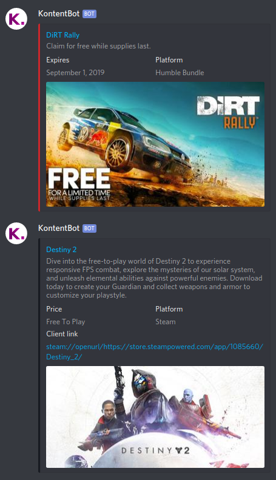

# KontentBot

KontentBot was developed to enable pretty embeds when posting games to a Discord's text channel. Nowadays it does a few things more, more on those below.

This is intended to be a tool for a very small number of people and developed pretty fast. Therefore it is pretty simple and doesn't have complicated features.

A few examples of a post below:

> Note! The `Client link` can't be hidden behind text, because Discord won't allow clickable links with `steam` protocol when the whole link is not visible.

## Metadata lookup
KontentBot automatically looks up for certain metadata when it receives a link, and uses that to auto populate fields like title, description, price, platform and image. Then all you need to do is to make edits as you wish and hit publish.

## Platform specific features
Some features are only available for links to the specific platforms. For example, when publishing Steam link, it automatically adds ``Client link``, that will open the link in the Steam client and GOG links will add ``DRM-free: Yes`` block to the post. The color of the post's left side is based on the platform in question.

## Usage
The easiest way to get the app running is to run it in debug mode. Clone the repository, install dependencies with ``yarn`` or ``npm install``. Then open the project in Visual Studio code, fill the file ``.vscode/launch.json`` and press F5. Other editors are also fine, but the provided ``launch.json`` is for Visual Studio Code. After that, the app should be accessible at ``localhost:3000``.

The project also includes ``Dockerfile`` and ``.gitlab-ci.yml`` to enable automatic build of Docker images. To enable that, the project should be in GitLab instance with at least one available GitLab CI Runner.

### Note about running in production mode on local machine
You are probably unable to login when running in production mode on the local machine. Production mode forces cookies to be served over secure connection, which usually is not the case on the local machine. Therefore the browser won't send authentication cookie to the server and you seem to be logged out.
